 

**Apprentice software developer** (Fachinformatiker für Anwendungsentwicklung) from Stuttgart. 
I like clean UI systems, well-structured code and shipping things people actually use.

 

## `~/projects`

<table>
  <tr>
    <td width="33%" valign="top">
      <h3>🧭 <a href="https://github.com/FinnLou1/SozialKompass">SozialKompass</a></h3>
      Open-source platform that makes local social support services (food banks, food sharing, …) easy to find on a map.
        
      <code>open-data</code> <code>geolocation</code> <code>rest-api</code>
    </td>
    <td width="33%" valign="top">
      <h3>🎨 <a href="https://github.com/FinnLou1/Vireon-UI">Vireon UI</a></h3>
      Lightweight React UI library for scalable design systems: accessible, token-based and built to work with Tailwind.
        
      <code>react</code> <code>design-system</code> <code>a11y</code>
    </td>
  </tr>
</table>

## `~/stack`

| | |
|---|---|
| **Frontend** |      |
| **Backend** |    |
| **Data** |    |
| **Tools** |   |

 

  <code>$ exit</code> · thanks for stopping by 👋

